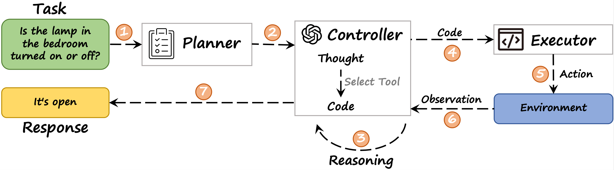
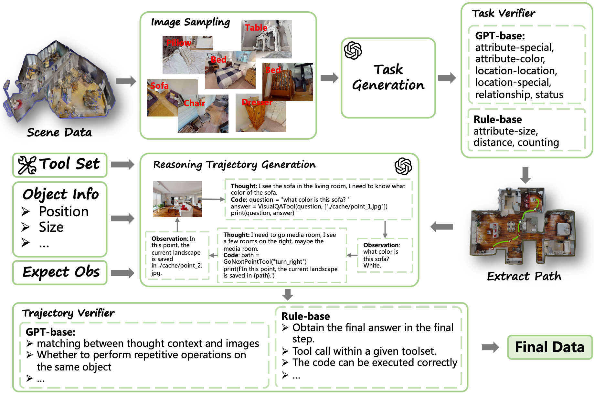
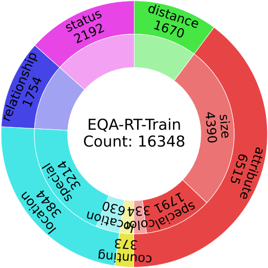
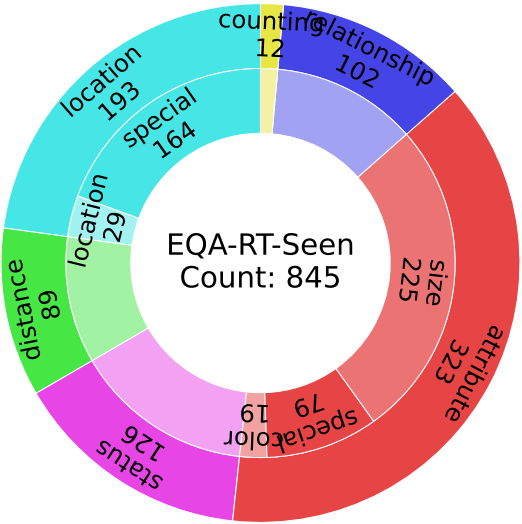
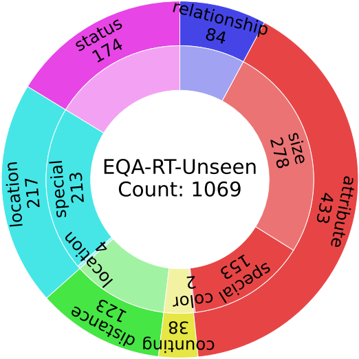

<p align="center">
  <h1 align="center">ToolEQA: Multi-Step Reasoning for Embodied Question Answering via Tool Augmentation</h1>
  <p align="center">
    <a href="https://zmling22.github.io/">Mingliang Zhai</a>
    ·
    <a>Hansheng Liang</a>
    ·
    <a href="https://scholar.google.com/citations?user=3hzR8qQAAAAJ&hl=zh-CN">Xiaomeng Fan</a>
    ·
    <a href="https://zhigao2017.github.io/">Zhi Gao</a>
    ·
    <a href="https://nevermorelch.github.io/">Chuanhao Li</a>
    ·
    <a href="https://www.smbu.edu.cn/info/5731/120101.htm">Che Sun</a>
    ·
    <a href="https://me.bit.edu.cn/szdw/jsml/jlgcx/tzjlyjs/bssds1/76658c28d7904b158e2cd8e57efe3e4e.htm">Xu Bin</a>
    ·
    <a href="https://wu-yuwei-bit.github.io/">Yuwei Wu</a>
    ·
    <a href="https://cs.bit.edu.cn/szdw/jsml/bssds/cf032ae4027040938653c343ba88d2a7.htm">Yunde Jia</a>
  </p>
  <!-- <h3 align="center">CVPR 2025</h3> -->
  <h3 align="center"><a href="https://arxiv.org/abs/2510.20310">Paper</a> | <a href="https://tooleqa.github.io/">Project Page</a> | <a href="https://tooleqa.github.io/">Data(coming soon)</a> </h3>
  <div align="center"></div>
</p>

<figure style="display: flex; flex-direction: column; align-items: center; margin: 0;">
  
  <figcaption style="font-size: 14px; color: gray; text-align: center">Figure 1. The workflow of ToolEQA.</figcaption>
</figure>

We introduce **ToolEQA**, an agent that integrates external tools with multi-step reasoning, where external tools can provide more useful information for completing the task, helping the model derive better exploration directions in the next step of reasoning and thus obtaining additional effective information. This enables ToolEQA to generate more accurate responses with a shorter exploration distance. To enhance the model's ability for tool-usage and multi-step reasoning, we further design a novel EQA data generation pipeline that automatically constructs large-scale EQA tasks with reasoning trajectories and corresponding answers.


# Installation
Set up the conda environment (Linux, Python 3.9):
```
conda env create -f environment.yml
conda activate explore-eqa
pip install -e .
```

Install the latest version of [Habitat-Sim](https://github.com/facebookresearch/habitat-sim) (headless with no Bullet physics) with:
```
conda install habitat-sim headless -c conda-forge -c aihabitat
```

Install [flash-attention2](https://github.com/Dao-AILab/flash-attention):
```
pip install flash-attn --no-build-isolation
```

Install transformers for qwenvl
```
pip install git+https://github.com/huggingface/transformers
pip install qwen-vl-utils
```

Install AutoGPTQ
```
git clone https://github.com/PanQiWei/AutoGPTQ.git && cd AutoGPTQ
pip install -vvv --no-build-isolation -e .
```

Install DetAny3D
```
git clone https://github.com/zmling22/DetAny3D.git
cd DetAny3D
# install SegmentAnything
pip install git+https://github.com/facebookresearch/segment-anything.git
# install UniDepth
git clone https://github.com/lpiccinelli-eth/UniDepth.git
cd UniDepth
pip install -e . --extra-index-url https://download.pytorch.org/whl/cu118
cd ..
git clone https://github.com/IDEA-Research/GroundingDINO.git
cd GroundingDINO
pip install -e .
cd ..
```

# Data Generation Pipeline
1. extract objects from scene
```
sh data/ToolTrajectory/gen_semantic/run_gen_sem_ddp.sh
```
2. generate and evaluate question and answer
```
# sample images
python data/ToolTrajectory/preprocessing/sampler.py
# generate question and answer
sh data/ToolTrajectory/question_generation/scripts/generate.sh
# evaluate
python data/ToolTrajectory/postprocessing/question_filter.py
```

3. generate trajectories
```
# save shorest path
python data/ToolTrajectory/postprocessing/trajectory.py
# generate thought and code
python data/ToolTrajectory/trajectory_gen/attribute/color/color_react_gen_step_withans.py
python data/ToolTrajectory/trajectory_gen/attribute/size/size_react_gen_step_withans.py
python data/ToolTrajectory/trajectory_gen/attribute/special/special_react_gen_step_withans.py
python data/ToolTrajectory/trajectory_gen/counting/counting_react_gen_step_withans.py
python data/ToolTrajectory/trajectory_gen/distance/distance_react_gen_step_withans.py
python data/ToolTrajectory/trajectory_gen/location/location/location_react_gen_step_withans_oneobject.py
python data/ToolTrajectory/trajectory_gen/location/location/location_react_gen_step_withans_twoobject.py
python data/ToolTrajectory/trajectory_gen/relationship/relationship_react_gen_step_withans.py
python data/ToolTrajectory/trajectory_gen/status/status_react_gen_step_withans.py
```

4. evaluate thought and code
```
sh data/ToolTrajectory/trajectory_gen/attribute/color/post_process.sh
sh data/ToolTrajectory/trajectory_gen/attribute/size/post_process.sh
sh data/ToolTrajectory/trajectory_gen/attribute/special/post_process.sh
sh data/ToolTrajectory/trajectory_gen/counting/post_process.sh
sh data/ToolTrajectory/trajectory_gen/distance/post_process.sh
sh data/ToolTrajectory/trajectory_gen/location/location/post_process_one.sh
sh data/ToolTrajectory/trajectory_gen/location/location/post_process_two.sh
sh data/ToolTrajectory/trajectory_gen/location/special/post_process.sh
sh data/ToolTrajectory/trajectory_gen/relationship/post_process.sh
sh data/ToolTrajectory/trajectory_gen/status/post_process.sh
```

# Train Qwen2.5VL
```
cd src/train/Qwen2.5-VL/qwen-vl-finetune/
sh scripts/sft_7b.sh
```

# Run ToolEQA
```
# run DetAny3D
cd DetAny3D
python app_mp.py
# run ToolEQA
cd ../ToolEQA
python src/agents/react_eqa_agent_mp.py --gpus 1,2,3,4
# python src/agents/react_eqa_infer.py # run on single question.
```

# Evaluation
```
python src/evaluation/eval_results_on_json.py
```

# Data
## Generate Pipeline
<figure style="display: flex; flex-direction: column; align-items: center; margin: 0;">
  
  <figcaption style="font-size: 14px; color: gray; text-align: center">Figure 2. The workflow of ToolEQA.</figcaption>
</figure>
Our goal is to generate a large set of diverse, practical, and complex EQA tasks. We first apply a 3D detection model to obtain each object's bounding box, position, and category, and sample the object image from detected objects. The object attributes and corresponding visual information are then fed into GPT-4o along with example question-answer pairs designed from brainstorming to simulate natural home conversations. Guided by the prompt, GPT-4o generates questions and answers across six types: relationship, status, distance, location, counting, and attribute, where location is divided into two subcategories `location-location' and `location-special', and attribute is divided into three subcategories `color', `special', and `size'. The answers are open-ended or multiple-choice, enabling the evaluating different capabilities of agents.

<div style="display: flex; justify-content: center; gap: 10px;">
  <figure style="text-align: center; margin: 0;">
    
    <figcaption style="font-size: 14px; color: gray; text-align: center">(a) EQA-RT-Train</figcaption>
  </figure>
  <figure style="text-align: center; margin: 0;">
    
    <figcaption style="font-size: 14px; color: gray; text-align: center">(b) EQA-RT-Seen</figcaption>
  </figure>
  <figure style="text-align: center; margin: 0;">
    
    <figcaption style="font-size: 14px; color: gray; text-align: center">(c) EQA-RT-Unseen</figcaption>
  </figure>
</div>
<figcaption style="font-size: 14px; color: gray; text-align: center">Figure 3. Data statistic of different split. </figcaption>

In figure 3, we have statistics of the training set (EQA-RT-Train) and two test sets (EQA-RT-Seen and EQA-RT-Unseen). The scenes in EQA-RT-Seen have the overlap with EQA-RT-Train, while the scenes in EQA-RT-Unseen are not present in the training set.

# Deployment
We deploy ToolEQA on [Unitree Go2 EDU](https://support.unitree.com/home/zh/developer). The specific implementation is as follows:

## 1. CycloneDDS
```
cd ~
git clone https://github.com/eclipse-cyclonedds/cyclonedds -b releases/0.10.x
cd cyclonedds
mkdir build install && cd build
cmake .. -DCMAKE_INSTALL_PREFIX=../install
cmake --build . --target install
# Use absolute path on export
export CYCLONEDDS_HOME="/home/<user>/cyclonedds/install"
cd ~/unitree_sdk2_python
pip3 install -e .
```
## 2. Unitree SDK2 (python)
```
cd ~
sudo apt update
sudo apt install -y python3-pip git
git clone https://github.com/unitreerobotics/unitree_sdk2_python.git
cd unitree_sdk2_python
pip3 install -e .
```
## 3. Intel RealSense
```
sudo apt-key adv --keyserver keyserver.ubuntu.com --recv-key F6E65AC044F831AC80A06380C8B3A55A6F3EFCDE
sudo add-apt-repository "deb https://librealsense.intel.com/Debian/apt-repo $(lsb_release -cs) main" -u
sudo apt-get install -y librealsense2-utils librealsense2-dev

# Python binding
pip3 install pyrealsense2
```
## 4. Client
```
# todo
```
## 5. Server
```
python src/agents/tool_eqa_go2.py --question [your question]
```

# Citation
If you find our paper and code useful in your research, please consider giving a star ⭐ and citation 📝 (´▽`ʃ♡ƪ)
```
@misc{zhai2025multistepreasoningembodiedquestion,
      title={Multi-Step Reasoning for Embodied Question Answering via Tool Augmentation}, 
      author={Mingliang Zhai and Hansheng Liang and Xiaomeng Fan and Zhi Gao and Chuanhao Li and Che Sun and Xu Bin and Yuwei Wu and Yunde Jia},
      year={2025},
      eprint={2510.20310},
      archivePrefix={arXiv},
      primaryClass={cs.AI},
      url={https://arxiv.org/abs/2510.20310}, 
}
```

# Acknowledge
Our project is built upon [MAT-Agent](https://github.com/mat-agent/MAT-Agent) and [QwenVL](https://github.com/QwenLM/Qwen2.5-VL), leveraging their robust codebases and the exceptional language capabilities of base model.
